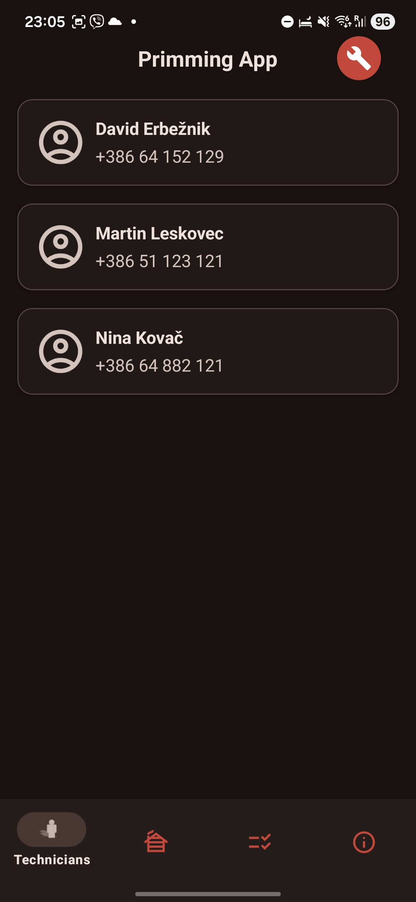
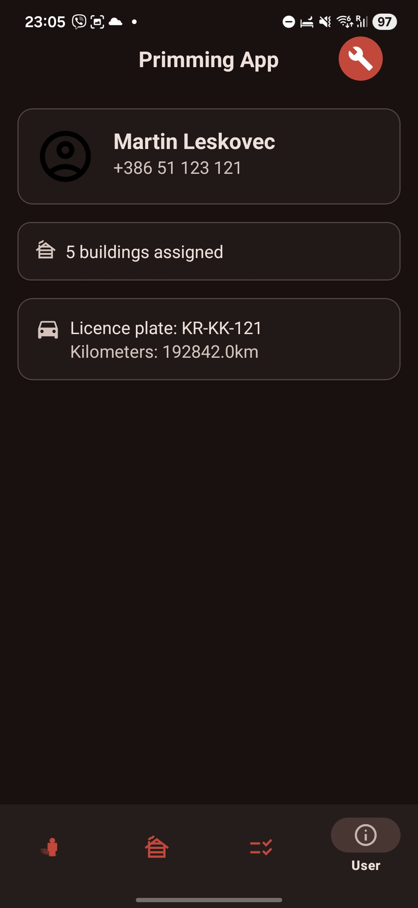
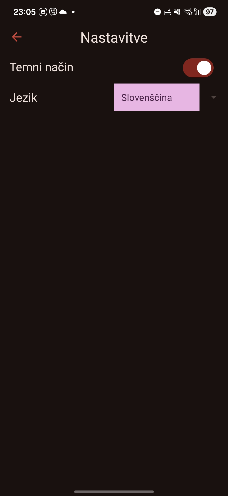
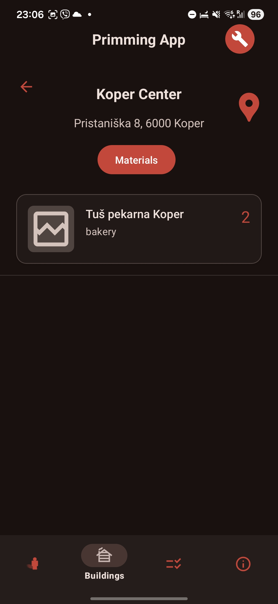
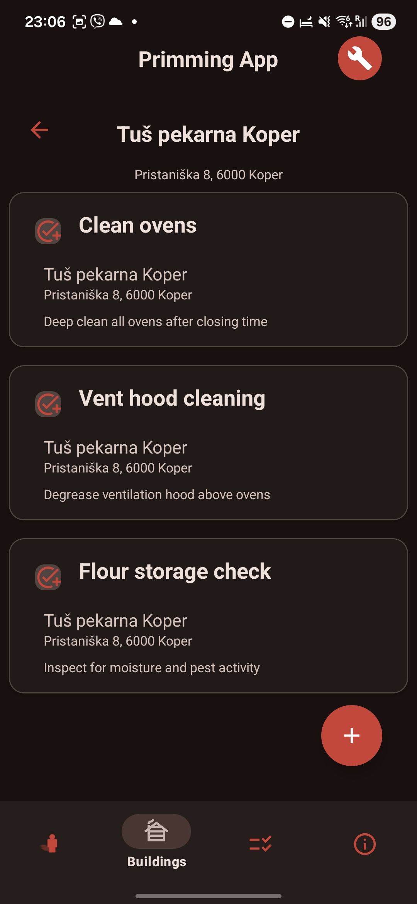
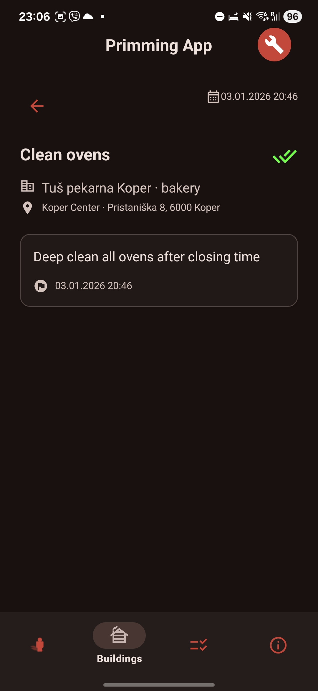
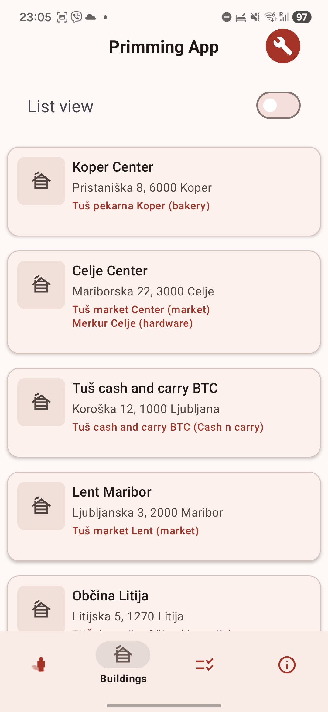
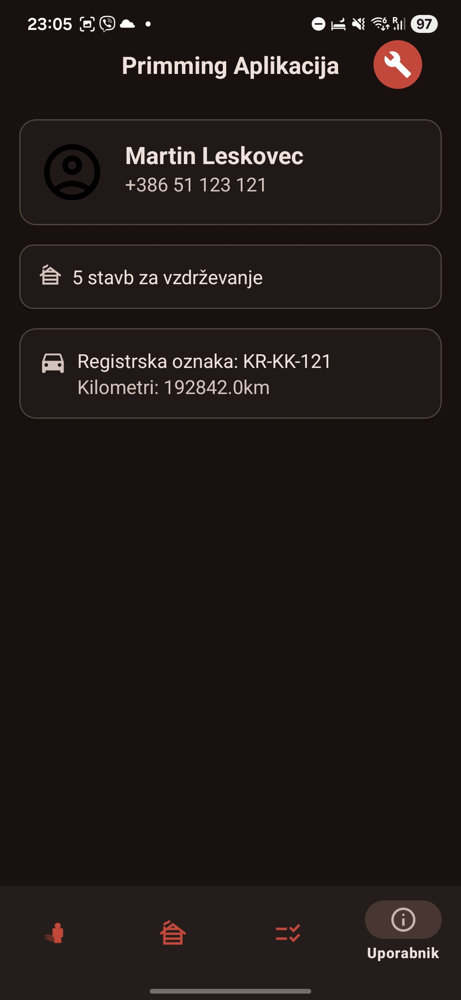
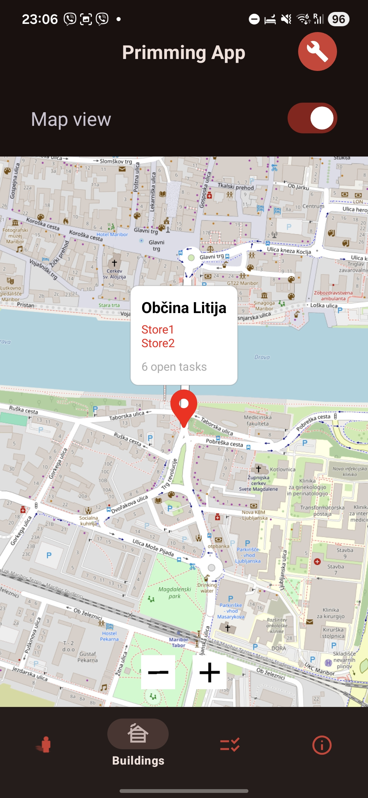

# StoreMaintenance

**Avtor:** Maj Verhovnik Marovšek

## Pregled
**StoreMaintenance** je Android aplikacija, namenjena vzdrževalnim podjetjem za centralizirano upravljanje podatkov o objektih, trgovinah, materialih in vzdrževalnih nalogah.  
Aplikacija nadomešča papirne delovne naloge s strukturiranim digitalnim sistemom ter izboljšuje preglednost, načrtovanje in navigacijo za vzdrževalce.

---

## Namen aplikacije
- Poenostavitev komunikacije o objektih in trgovinah znotraj vzdrževalnega podjetja
- Zamenjava papirnih delovnih nalogov s centralizirano digitalno bazo podatkov
- Tehnikom omogočiti jasen, lokacijsko podprt dostop do nalog in informacij o objektih

---

## Ključne funkcionalnosti
- Ustvarjanje in brisanje nalog
- Pregled vzdrževalnega materiala po posamezni trgovini
- Pregled trgovin v seznamu in na zemljevidu
- Ustvarjanje in upravljanje vzdrževalnih nalog z roki izvedbe
- Push obvestila
- Pregled podatkov o tehniku in dodeljenem vozilu
- Pregled kontaktov ostalih zaposlenih

---

## Uporabljene tehnologije
- **Android Studio** – razvoj Android aplikacije
- **Express.js** – zaledni API
- **MySQL** – shranjevanje podatkov

---

## Možne prihodnje nadgradnje
- Offline podpora z lokalnim predpomnjenjem in sinhronizacijo z zaledjem
- Več uporabniških vlog (administrator, tehnik, vodja)
- Napredna statistika in analitika porabe materiala
- Izboljšani mehanizmi varnostnih kopij in obnove podatkov 
- Varna prijava uporabnikov

---

## Posnetki zaslona aplikacije

### Glavni zasloni

  
  
  
   
  
  

---

### Podrobni zasloni

  
  
  

---

### Dodatne funkcionalnosti
- Preklapljanje jezika in teme
- Ustvarjanje in urejanje nalog
- Pogled zemljevida z označenimi objekti
- Navigacija v podrobnosti objekta ob ponovnem kliku na marker
- Neposredna integracija z Google Maps za navigacijo do lokacije objekta

  
  
  
  

